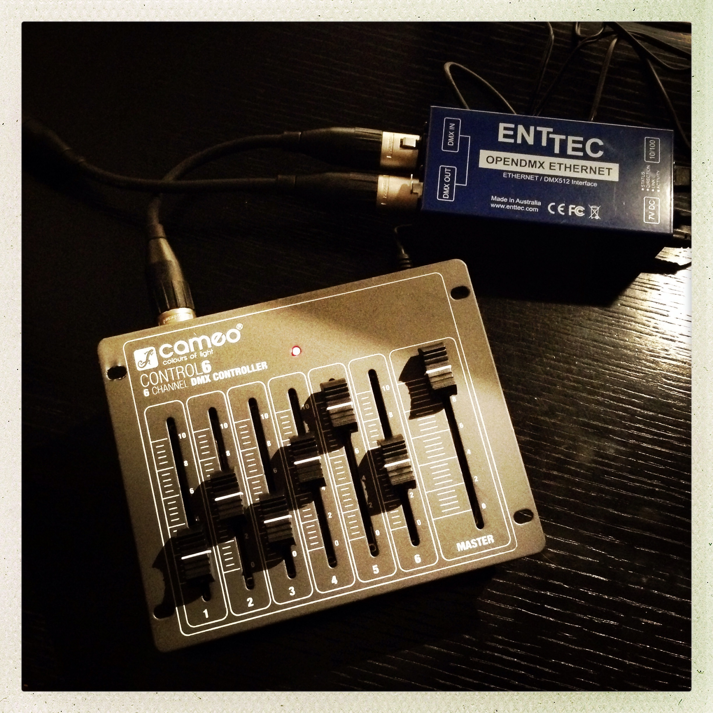
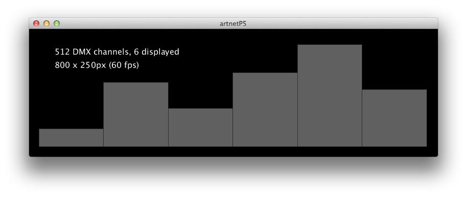
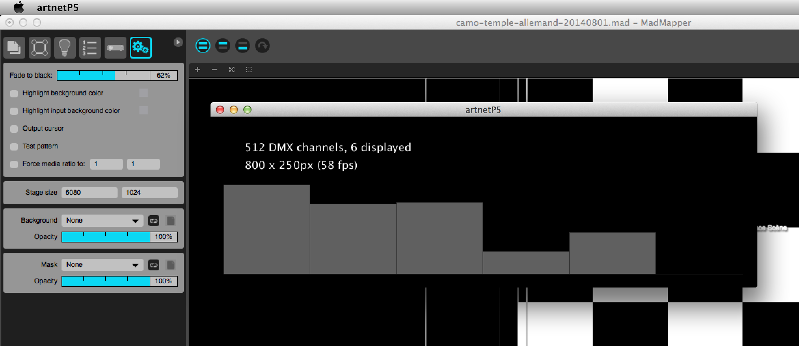

# ArtnetP5

A Processing sketch that listens to ArtNet DMX Input packets and displays the values of the 6 first channels as a graph bar.

Uses the [Artnet4j-Elios](https://github.com/Eliosoft/artnet4j-elios) library to listen to the ArtNet network. This library is a fork supporting DMX Input, based on [ArtNet4j](https://code.google.com/p/artnet4j/) by Karsten Schmidt (toxilibs).

## Sample output

## Motivations

I wrote this small Processing application to:

1. Test receiving DMX Input events from the 6 DMX channels of a [Cameo Control6](http://www.cameolight.com/en/products/dmx-controllers/control-6-6-channel-dmx-controller/) DMX lightning console received as ArtNet datagrams thru [Enttec's OpenDMX Ethernet](http://www.enttec.com/ode) (pictured above)
2. Understand the content of ArtNet datagrams, namely how and when the DMX channel values were transmitted
3. Check whether or not it was possible to have multiple applications reacting to the same DMX Input events.

## What I found out

That for the illustrated setup, the ArtNet datagrams were:

* either containing the values of the 6 DMX channels of the lightning console, being sent when changing the positions of the cursors
* or the values of all 512 DMX channels of the universe/subnet, being sent from time to time.
 
And that it was indeed possible to have multiple application listen to the same DMX Input events, provided the ArtNet4j library was [patched to set the SO_REUSEADDR socket option](https://github.com/olange/artnet4j-elios/commit/67f4a3362d602cc97cc5849a13d64fa58124abb3) of the ArtNetServer socket listener. Otherwise only one of the two apps would see and react to the ArtNet datagrams.

## See also

* [Artnet4j installation](docs/artnet4j-installation.md) _Describes how to build Artnet4j JAR and configure Enttec's OpenDMX Ethernet_
