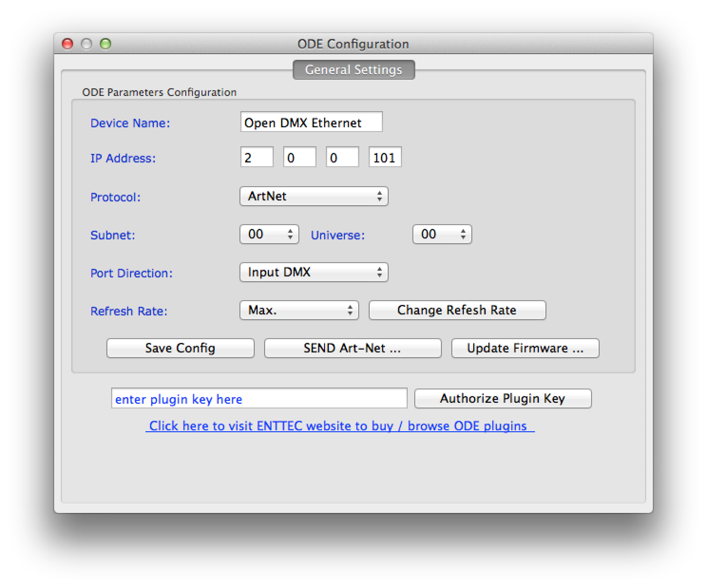
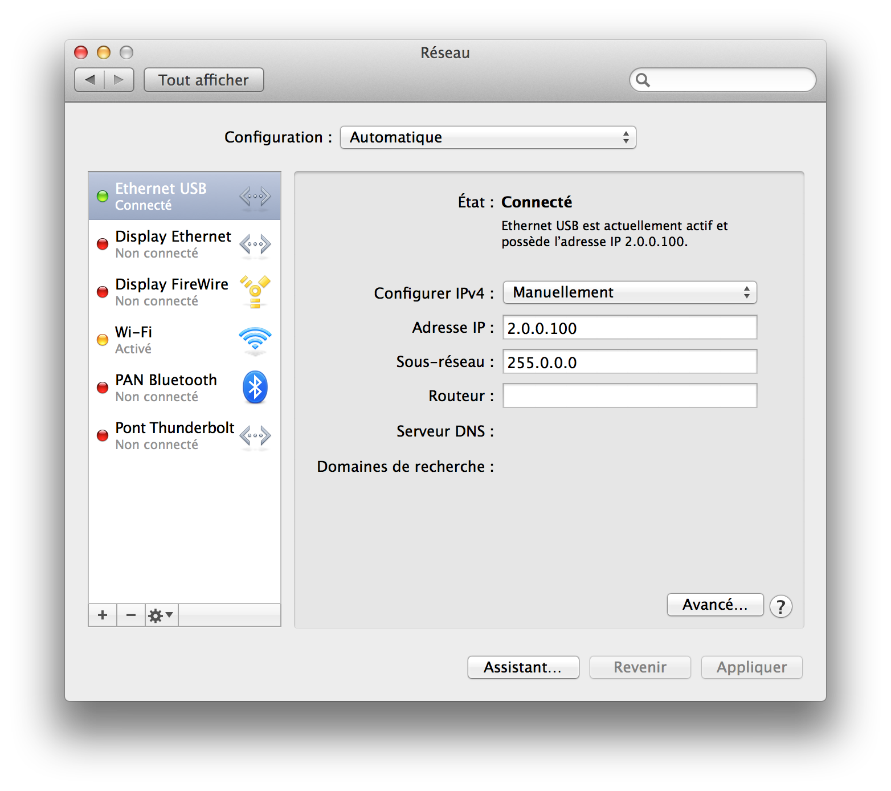

# ArtNet4j and Enttec OpenDMX Ethernet

Using [Artnet4j-Elios](https://github.com/Eliosoft/artnet4j-elios) by Alexandre Collignon and Jérémie Gaston-Raoul

... which is a fork supporting DMX Input, based on [ArtNet4j](https://code.google.com/p/artnet4j/) by Karsten Schmidt (toxilibs)

Source: [Issue 2: ArtNetServer doesn't receive ArtDmx packets, so can't recieve DMX data via ArtNet](https://code.google.com/p/artnet4j/issues/detail?id=2)

## How to add a JAR to a Processing project? 

a) create "code" folder in your sketch folder.
b1) put jar file (library) into this folder
b2) if you dont have jar library file, put java souce files in your sketch folder
c) initiate library object in your sketch 

Source: [Processing forums / ArtNet4j](http://forum.processing.org/one/topic/artnet4j.html)

## How to use ArtNet4J to receivre DMX packets?

ArtNetServerManager.java
https://github.com/Eliosoft/elios/blob/master/src/main/java/net/eliosoft/elios/server/ArtNetServerManager.java

## Network configuration

* Enttec OpenDMX Ethernet: 2.0.0.101 / 255.0.0.0
  

* Computer USB Ethernet: 2.0.0.100 / 255.0.0.0
  

## Building and testing Artnet4j

Build JAR file

    hg clone https://code.google.com/p/artnet4j/
    cd artnet4j
    ant jars

Test

    javac -cp ./bin -d ./bin src.test/artnet4j/test/PollTest.java
    java -cp ./bin artnet4j.test.PollTest

If it works:

    ~/Sources/artnet4j $ java -cp ./bin artnet4j.test.PollTest
    août 31, 2014 8:17:58 PM artnet4j.ArtNet <init>
    INFO: Art-Net v0001-20091119
    août 31, 2014 8:17:58 PM artnet4j.ArtNetServer start
    INFO: Art-Net server started at port: 6454
    août 31, 2014 8:17:58 PM artnet4j.ArtNetNodeDiscovery discoverNode
    INFO: discovered new node: /2.0.0.101
    août 31, 2014 8:17:58 PM artnet4j.ArtNetNode extractConfig
    INFO: updated node config
    found net lynx
    1 nodes found:
    node: ST_NODE /2.0.0.101 Open DMX Ethernet, 1 ports, subswitch: 00
    ...

## Building ArtNet4j-Elios

Build JAR File

    git clone https://github.com/Eliosoft/artnet4j-elios.git
    cd artnet4j-elios
    mvn package

Documentation

    mvn javadocs:javadocs (or mvn site)
    open target/site/apidocs/index.html

Test

    java -cp target/artnet4j-0001.jar:target/test-classes/ artnet4j.test.PollTest

If it works, using Enttec's OpenDMX Ethernet, you'll get something along the lines of:

    ~/Sources/artnet4j-elios (master)$ java -cp target/artnet4j-0001.jar:target/test-classes/ artnet4j.test.PollTest
    août 31, 2014 8:04:08 PM artnet4j.ArtNet <init>
    INFO: Art-Net v0001-20091119
    août 31, 2014 8:04:08 PM artnet4j.ArtNetServer start
    INFO: Art-Net server started at port: 6454
    août 31, 2014 8:04:08 PM artnet4j.ArtNetNodeDiscovery discoverNode
    INFO: discovered new node: /2.0.0.101
    août 31, 2014 8:04:08 PM artnet4j.ArtNetNode extractConfig
    INFO: updated node config
    found net lynx
    1 nodes found:
    node: ST_NODE /2.0.0.101 Open DMX Ethernet, 1 ports, subswitch: 00
    ...

If it doesn't see any ArtNet device, you'll get:

    ~/Sources/artnet4j-elios (master)$ java -cp target/artnet4j-0001.jar:target/test-classes/ artnet4j.test.PollTest
    août 31, 2014 2:11:53 PM artnet4j.ArtNet <init>
    INFO: Art-Net v0001-20091119
    août 31, 2014 2:11:53 PM artnet4j.ArtNetServer start
    INFO: Art-Net server started at port: 6454
    0 nodes found:
    0 nodes found:
    0 nodes found:
    ...

## Installing Mercurial, Git, Ant and Maven

    brew install hg (for Artnet4j)
    brew install ant (for ArtNet4j)

    brew install git (for ArtNet4j-Elios)
    brew install maven (for ArtNet4j-Elios)
